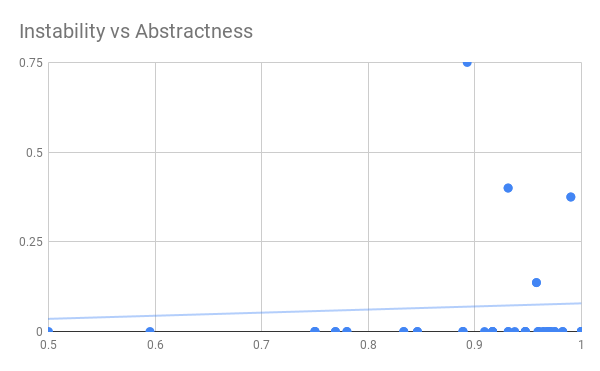

# DepencyMatrixV2

[Project aries](https://github.com/apache/aries)  
Only check from 'util' because aries project have a lot of different source folder so we choose to only check 'util' folder

  
You can find the data and scatter plot graph [here](https://docs.google.com/spreadsheets/d/1BibZbaCLAIpCm7MSevL2cmK38BOBsKCYYxYIDbF_cTc/edit?usp=sharing).

Member:
Theeruth Borisuth 5910545701
Nitith   Chayakul 5910545736
